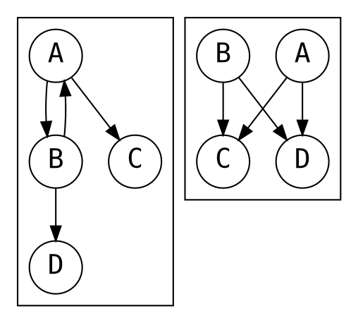
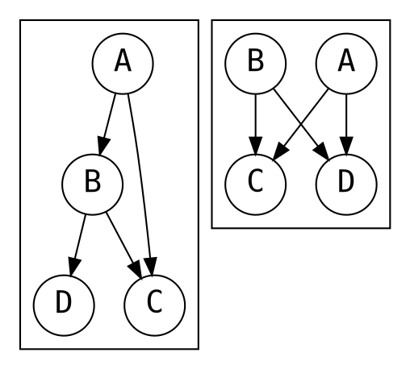

上次竟然没说完。

``` go
func Compile(re *Regexp) (*Prog, error) {
    var c compiler
    c.init()
    f := c.compile(re)
    f.out.patch(c.p, c.inst(InstMatch).i)
    c.p.Start = int(f.i)
    return c.p, nil
}
```

然后再回忆一下返回的 `f` 是什么。

``` plaintext
[1] Inst{Op: InstRune1, Out: 2,    Arg: 0, Rune: []rune{'a'}}
[2] Inst{Op: InstRune1, Out: 4<<1, Arg: 0, Rune: []rune{'b'}}
[3] Inst{Op: InstRune1, Out: 4,    Arg: 0, Rune: []rune{'c'}}
[4] Inst{Op: InstRune1, Out: 7<<1, Arg: 0, Rune: []rune{'d'}}
[5] Inst{Op: InstAlt,   Out: 1,    Arg: 3, Rune: nil}
[6] Inst{Op: InstRune1, Out: 7,    Arg: 0, Rune: []rune{'e'}}
[7] Inst{Op: InstRune1, Out: 0,    Arg: 0, Rune: []rune{'f'}}
[8] Inst{Op: InstAlt,   Out: 5,    Arg: 6, Rune: nil}

f: frag{i: 8, out: patchList{2<<1, 7<<1}}
```

然后 `Compile()` 插入了 `InstMatch` ，然后 `patch()` 。

``` plaintext
[1] Inst{Op: InstRune1, Out: 2, Arg: 0, Rune: []rune{'a'}}
[2] Inst{Op: InstRune1, Out: 9, Arg: 0, Rune: []rune{'b'}}
[3] Inst{Op: InstRune1, Out: 4, Arg: 0, Rune: []rune{'c'}}
[4] Inst{Op: InstRune1, Out: 9, Arg: 0, Rune: []rune{'d'}}
[5] Inst{Op: InstAlt,   Out: 1, Arg: 3, Rune: nil}
[6] Inst{Op: InstRune1, Out: 7, Arg: 0, Rune: []rune{'e'}}
[7] Inst{Op: InstRune1, Out: 9, Arg: 0, Rune: []rune{'f'}}
[8] Inst{Op: InstAlt,   Out: 5, Arg: 6, Rune: nil}
[9] Inst{Op: InstMatch, Out: 0, Arg: 0, Rune: nil}
```

最后， `Start` 是 `8` 。虽然不知道怎么回事但是 it works ？再捋一捋 `head` 和 `tail` 的作用。似乎理解了，当存在多个岔路的时候，会形成某种链表关系。 `head` 和 `tail` 是链表的头尾，它们的作用是帮助链表的连接。

``` go
    matchcap := prog.NumCap
    if matchcap < 2 {
        matchcap = 2
    }
    regexp := &Regexp{
        expr:        expr,
        prog:        prog,
        onepass:     compileOnePass(prog),
        numSubexp:   maxCap,
        subexpNames: capNames,
        cond:        prog.StartCond(),
        longest:     longest,
        matchcap:    matchcap,
        minInputLen: minInputLen(re),
    }
    // to be continued...
```

返回到 `compile()` 函数。这里最终生成了编译好的正则表达式，但是构造这个结构体的同时还调用了许多函数。一个个来看，首先是 `compileOnePass()` 。

## One-Pass 优化

`compileOnePass()` 会尝试把编译好的 `Prog` 重新梳理，变成具有 One-Pass 属性的 `Prog` 。如果不能产生这样的 `Prog` ，就返回 `nil` 。 One-Pass 属性指的是任意 `InstAlt` 指令处，都能够非歧义地决定跳向哪个分支。

``` go
func compileOnePass(prog *syntax.Prog) (p *onePassProg) {
    if prog.Start == 0 {
        return nil
    }
    // onepass regexp is anchored
    if prog.Inst[prog.Start].Op != syntax.InstEmptyWidth ||
        syntax.EmptyOp(prog.Inst[prog.Start].Arg)&syntax.EmptyBeginText != syntax.EmptyBeginText {
        return nil
    }

    // every instruction leading to InstMatch must be EmptyEndText
    for _, inst := range prog.Inst {
        opOut := prog.Inst[inst.Out].Op
        switch inst.Op {
        default:
            if opOut == syntax.InstMatch {
                return nil
            }
        case syntax.InstAlt, syntax.InstAltMatch:
            if opOut == syntax.InstMatch || prog.Inst[inst.Arg].Op == syntax.InstMatch {
                return nil
            }
        case syntax.InstEmptyWidth:
            if opOut == syntax.InstMatch {
                if syntax.EmptyOp(inst.Arg)&syntax.EmptyEndText == syntax.EmptyEndText {
                    continue
                }
                return nil
            }
        }
    }
    // to be continued...
```

根据以上代码， One-Pass 属性要求：

1. 第一个指令必须是一个空匹配指令，且匹配的是文首位置。
2. 如果本条指令是 `InstEmptyWidth` 指令，且下一条是 `InstMatch` 指令，那么本条指令必须是匹配文末位置的。
3. 如果本条指令是 `InstAlt` 指令（ `compile()` 期间似乎没有生成过 `InstAltMatch` 指令），那么下一条不能是 `InstMatch` 。
4. 其他指令，下一条不能是 `InstMatch` 。

总结来说，One-Pass 属性要求开头必须有匹配文首的操作符，结束时必须有匹配文末的操作符。

``` go
    // Creates a slightly optimized copy of the original Prog
    // that cleans up some Prog idioms that block valid onepass programs
    p = onePassCopy(prog)
    // to be continued...
```

如果满足这样严苛的要求，那么就可以生成一个优化的版本。

``` go
// A onePassProg is a compiled one-pass regular expression program.
// It is the same as syntax.Prog except for the use of onePassInst.
type onePassProg struct {
    Inst   []onePassInst
    Start  int // index of start instruction
    NumCap int // number of InstCapture insts in re
}

// A onePassInst is a single instruction in a one-pass regular expression program.
// It is the same as syntax.Inst except for the new 'Next' field.
type onePassInst struct {
    syntax.Inst
    Next []uint32
}

// onePassCopy creates a copy of the original Prog, as we'll be modifying it
func onePassCopy(prog *syntax.Prog) *onePassProg {
    p := &onePassProg{
        Start:  prog.Start,
        NumCap: prog.NumCap,
        Inst:   make([]onePassInst, len(prog.Inst)),
    }
    for i, inst := range prog.Inst {
        p.Inst[i] = onePassInst{Inst: inst}
    }
    // to be continued...
```

首先对原来的程序进行了一个复制，但是 `Next` 字段还没有写。

``` go
    // rewrites one or more common Prog constructs that enable some otherwise
    // non-onepass Progs to be onepass. A:BD (for example) means an InstAlt at
    // ip A, that points to ips B & C.
    // A:BC + B:DA => A:BC + B:CD
    // A:BC + B:DC => A:DC + B:DC
    for pc := range p.Inst {
        switch p.Inst[pc].Op {
        default:
            continue
        case syntax.InstAlt, syntax.InstAltMatch:
            // A:Bx + B:Ay
            p_A_Other := &p.Inst[pc].Out
            p_A_Alt := &p.Inst[pc].Arg
            // make sure a target is another Alt
            instAlt := p.Inst[*p_A_Alt]
            if !(instAlt.Op == syntax.InstAlt || instAlt.Op == syntax.InstAltMatch) {
                p_A_Alt, p_A_Other = p_A_Other, p_A_Alt
                instAlt = p.Inst[*p_A_Alt]
                if !(instAlt.Op == syntax.InstAlt || instAlt.Op == syntax.InstAltMatch) {
                    continue
                }
            }
            instOther := p.Inst[*p_A_Other]
            // Analyzing both legs pointing to Alts is for another day
            if instOther.Op == syntax.InstAlt || instOther.Op == syntax.InstAltMatch {
                // too complicated
                continue
            }
            // simple empty transition loop
            // A:BC + B:DA => A:BC + B:DC
            p_B_Alt := &p.Inst[*p_A_Alt].Out
            p_B_Other := &p.Inst[*p_A_Alt].Arg
            patch := false
            if instAlt.Out == uint32(pc) {
                patch = true
            } else if instAlt.Arg == uint32(pc) {
                patch = true
                p_B_Alt, p_B_Other = p_B_Other, p_B_Alt
            }
            if patch {
                *p_B_Alt = *p_A_Other
            }

            // empty transition to common target
            // A:BC + B:DC => A:DC + B:DC
            if *p_A_Other == *p_B_Alt {
                *p_A_Alt = *p_B_Other
            }
        }
    }
    return p
}
```

这部分优化了一些 `InstAlt` 逻辑。首先，本节点必须是一个 `InstAlt` 节点，然后对于本节点 `A` 的两个分支 `p_A_alt` 和 `p_A_Other` ， `p_A_alt` 指向的必须是另一个 `InstAlt` 指令， `p_A_Other` 必须指向另一个非 `InstAlt` 指令。然后读取出 `p_A_alt` 指向的那条指令 `B` ，并分析它的两个分支。对它的两条分支分情况讨论。

第一种情况是有一条分支 `p_B_Alt` 指向 `A` 。注意，除了 `A` 和 `B` 之间的循环指向之外的另一条指令可以指向同一条指令。


第二种情况是没有循环指向，但是 `A` 和 `B` 的分支中有一个相同的。有点小问题的的是，只有 `p_A_Other` 和 `B.Out` 指向的那条指令相同时，才会优化。另一个分支没有进行判断。


到这里， One-Pass 优化就结束了，但是似乎没有看到所谓的歧义性处理。

``` go
    // checkAmbiguity on InstAlts, build onepass Prog if possible
    p = makeOnePass(p)
    // to be continued...
```

说完就来了。

``` go
// makeOnePass creates a onepass Prog, if possible. It is possible if at any alt,
// the match engine can always tell which branch to take. The routine may modify
// p if it is turned into a onepass Prog. If it isn't possible for this to be a
// onepass Prog, the Prog nil is returned. makeOnePass is recursive
// to the size of the Prog.
func makeOnePass(p *onePassProg) *onePassProg {
    // If the machine is very long, it's not worth the time to check if we can use one pass.
    if len(p.Inst) >= 1000 {
        return nil
    }
    // to be continued...
```

指令很长时，不值得进行优化。看来 One-Pass 优化适用范围不大，一旦指令很长，能够生成 One-Pass `Prog` 的可能性就很低了。

``` go
    var (
        instQueue    = newQueue(len(p.Inst))
        visitQueue   = newQueue(len(p.Inst))
        check        func(uint32, []bool) bool
        onePassRunes = make([][]rune, len(p.Inst))
    )

    // check that paths from Alt instructions are unambiguous, and rebuild the new
    // program as a onepass program
    check = func(pc uint32, m []bool) (ok bool) {
        // ...
    }

    instQueue.clear()
    instQueue.insert(uint32(p.Start))
    m := make([]bool, len(p.Inst))
    for !instQueue.empty() {
        visitQueue.clear()
        pc := instQueue.next()
        if !check(pc, m) {
            p = nil
            break
        }
    }
    if p != nil {
        for i := range p.Inst {
            p.Inst[i].Rune = onePassRunes[i]
        }
    }
    return p
}
```

看这段代码之前，需要介绍用到的数据结构。

``` go
// Sparse Array implementation is used as a queueOnePass.
type queueOnePass struct {
    sparse          []uint32
    dense           []uint32
    size, nextIndex uint32
}

func (q *queueOnePass) empty() bool {
    return q.nextIndex >= q.size
}

func (q *queueOnePass) next() (n uint32) {
    n = q.dense[q.nextIndex]
    q.nextIndex++
    return
}

func (q *queueOnePass) clear() {
    q.size = 0
    q.nextIndex = 0
}

func (q *queueOnePass) contains(u uint32) bool {
    if u >= uint32(len(q.sparse)) {
        return false
    }
    return q.sparse[u] < q.size && q.dense[q.sparse[u]] == u
}

func (q *queueOnePass) insert(u uint32) {
    if !q.contains(u) {
        q.insertNew(u)
    }
}

func (q *queueOnePass) insertNew(u uint32) {
    if u >= uint32(len(q.sparse)) {
        return
    }
    q.sparse[u] = q.size
    q.dense[q.size] = u
    q.size++
}

func newQueue(size int) (q *queueOnePass) {
    return &queueOnePass{
        sparse: make([]uint32, size),
        dense:  make([]uint32, size),
    }
}
```

用以前的例子 `ab|cd|ef` 。

``` plaintext
instQueue:
  size     [0]
  nextInst [0]
  sparse   [0, 0, 0, 0, 0, 0, 0, 0, 0, 0]
  dense    []

visitQueue:
  size     [0]
  nextInst [0]
  sparse   [0, 0, 0, 0, 0, 0, 0, 0, 0, 0]
  dense    []

m: [false, false, false, false, false, false, false, false, false, false]
```

在 `makeOnePass` 中，首先调用了 `insert(uint32(p.Start))` 。在 `insert()` 中先调用了 `contains()` 。

如果 `p.Start` 大于等于 `sparse` 数组的长度，那么直接返回 `false` 。否则，会进行一个比较复杂的判断。第一次调用 `q.sparse[u]` 必定是 0 ， `q.size == 0` ，所以 `contains()` 会返回 `false` 。

因此最后会调用 `insertNew()` ， `q.sparse[u] = 0` ， `q.dense[0] = u` ，然后 `q.size` 自增。

``` plaintext
instQueue:
  size     [1]
  nextInst [0]
  sparse   [0, 0, 0, 0, 0, 0, 0, 0, 0, 0]
  dense    [8]

visitQueue:
  size     [0]
  nextInst [0]
  sparse   [0, 0, 0, 0, 0, 0, 0, 0, 0, 0]
  dense    []

m: [false, false, false, false, false, false, false, false, false, false]
```

一直循环到 `instQueue` 为空。先调用 `visitQueue.clear()` ，然后调用了 `instQueue.next()` 。最后进行了 `check()` 。进入 `check()` 时，调用过一次 `next()` ，具体的调用参数是 `check(8, m)` 。

``` plaintext
instQueue:
  size     [1]
  nextInst [1]
  sparse   [0, 0, 0, 0, 0, 0, 0, 0, 0, 0]
  dense    [8]

visitQueue:
  size     [0]
  nextInst [0]
  sparse   [0, 0, 0, 0, 0, 0, 0, 0, 0, 0]
  dense    []

m: [false, false, false, false, false, false, false, false, false, false]
```

``` go
    check = func(pc uint32, m []bool) (ok bool) {
        ok = true
        inst := &p.Inst[pc]
        if visitQueue.contains(pc) {
            return
        }
        visitQueue.insert(pc)
        switch inst.Op {
        case syntax.InstAlt, syntax.InstAltMatch:
            ok = check(inst.Out, m) && check(inst.Arg, m)
            // check no-input paths to InstMatch
            matchOut := m[inst.Out]
            matchArg := m[inst.Arg]
            if matchOut && matchArg {
                ok = false
                break
            }
            // Match on empty goes in inst.Out
            if matchArg {
                inst.Out, inst.Arg = inst.Arg, inst.Out
                matchOut, matchArg = matchArg, matchOut
            }
            if matchOut {
                m[pc] = true
                inst.Op = syntax.InstAltMatch
            }

            // build a dispatch operator from the two legs of the alt.
            onePassRunes[pc], inst.Next = mergeRuneSets(
                &onePassRunes[inst.Out], &onePassRunes[inst.Arg], inst.Out, inst.Arg)
            if len(inst.Next) > 0 && inst.Next[0] == mergeFailed {
                ok = false
                break
            }
        // to be continued...
```

第一行会递归地检查 `InstAlt` 指令的两个分支，调用的是 `check(5, m)` 。然后会 `visitQueue.insert()` 。进入 `check(5, m)` 之前：

``` plaintext
instQueue:
  size     [1]
  nextInst [1]
  sparse   [0, 0, 0, 0, 0, 0, 0, 0, 0, 0]
  dense    [8]

visitQueue:
  size     [1]
  nextInst [0]
  sparse   [0, 0, 0, 0, 0, 0, 0, 0, 0, 0]
  dense    [8]

m: [false, false, false, false, false, false, false, false, false, false]
```

不幸的是 `5` 号节点也是个 `InstAlt` ，还需要递归下降，这次调用的是 `check(1, m)` 。进入 `check(1, m)` 之前：

``` plaintext
instQueue:
  size     [1]
  nextInst [1]
  sparse   [0, 0, 0, 0, 0, 0, 0, 0, 0, 0]
  dense    [8]

visitQueue:
  size     [2]
  nextInst [0]
  sparse   [0, 0, 0, 0, 0, 1, 0, 0, 0, 0]
  dense    [8, 5]

m: [false, false, false, false, false, false, false, false, false, false]
```

终于进入了 `check(1, m)` 。

``` go
        case syntax.InstRune1:
            m[pc] = false
            if len(inst.Next) > 0 {
                break
            }
            instQueue.insert(inst.Out)
            runes := []rune{}
            // expand case-folded runes
            if syntax.Flags(inst.Arg)&syntax.FoldCase != 0 {
                // omitted...
            } else {
                runes = append(runes, inst.Rune[0], inst.Rune[0])
            }
            onePassRunes[pc] = runes
            inst.Next = make([]uint32, len(onePassRunes[pc])/2+1)
            for i := range inst.Next {
                inst.Next[i] = inst.Out
            }
            inst.Op = syntax.InstRune
        // to be continued...
```

执行这一段之前：

``` plaintext
instQueue:
  size     [1]
  nextInst [1]
  sparse   [0, 0, 0, 0, 0, 0, 0, 0, 0, 0]
  dense    [8]

visitQueue:
  size     [3]
  nextInst [0]
  sparse   [0, 2, 0, 0, 0, 1, 0, 0, 0, 0]
  dense    [8, 5, 1]

m: [false, false, false, false, false, false, false, false, false, false]
```

执行完之后：

``` plaintext
instQueue:
  size     [2]
  nextInst [1]
  sparse   [0, 0, 1, 0, 0, 0, 0, 0, 0, 0]
  dense    [8, 2]

visitQueue:
  size     [3]
  nextInst [0]
  sparse   [0, 2, 0, 0, 0, 1, 0, 0, 0, 0]
  dense    [8, 5, 1]

m: [false, false, false, false, false, false, false, false, false, false]

Insts:
[1] {Op: InstRune, Next: [2, 2]}

Runes:
[1] ['a', 'a']
```

现在会进入 `5` 节点的另一个分支， `check(3, m)` 。这个节点也是个 `InstRune1` 类型。执行完之后：

``` plaintext
instQueue:
  size     [3]
  nextInst [1]
  sparse   [0, 0, 1, 0, 2, 0, 0, 0, 0, 0]
  dense    [8, 2, 4]

visitQueue:
  size     [4]
  nextInst [0]
  sparse   [0, 2, 0, 3, 0, 1, 0, 0, 0, 0]
  dense    [8, 5, 1, 3]

m: [false, false, false, false, false, false, false, false, false, false]

Insts:
[1] {Op: InstRune, Next: [2, 2]}
[3] {Op: InstRune, Next: [4, 4]}

Runes:
[1] ['a', 'a']
[3] ['c', 'c']
```

结束之后，回到了 `5` 节点。接下来的程序说明了 `m` 的作用， `m` 是 `match` 的缩写。

``` go
func mergeRuneSets(leftRunes, rightRunes *[]rune, leftPC, rightPC uint32) ([]rune, []uint32) {
    leftLen := len(*leftRunes)
    rightLen := len(*rightRunes)
    if leftLen&0x1 != 0 || rightLen&0x1 != 0 {
        panic("mergeRuneSets odd length []rune")
    }
    var (
        lx, rx int
    )
    merged := make([]rune, 0)
    next := make([]uint32, 0)
    ok := true
    defer func() {
        if !ok {
            merged = nil
            next = nil
        }
    }()

    ix := -1
    extend := func(newLow *int, newArray *[]rune, pc uint32) bool {
        if ix > 0 && (*newArray)[*newLow] <= merged[ix] {
            return false
        }
        merged = append(merged, (*newArray)[*newLow], (*newArray)[*newLow+1])
        *newLow += 2
        ix += 2
        next = append(next, pc)
        return true
    }

    for lx < leftLen || rx < rightLen {
        switch {
        case rx >= rightLen:
            ok = extend(&lx, leftRunes, leftPC)
        case lx >= leftLen:
            ok = extend(&rx, rightRunes, rightPC)
        case (*rightRunes)[rx] < (*leftRunes)[lx]:
            ok = extend(&rx, rightRunes, rightPC)
        default:
            ok = extend(&lx, leftRunes, leftPC)
        }
        if !ok {
            return noRune, noNext
        }
    }
    return merged, next
}
```

执行完这一段：

``` plaintext
Insts:
[1] {Op: InstRune, Next: [2, 2]}
[3] {Op: InstRune, Next: [4, 4]}
[5] {Op: InstAlt,  Next: [1, 3]}

Runes:
[1] ['a', 'a']
[3] ['c', 'c']
[5] ['a', 'a', 'c', 'c']
```

越来越迷惑。返回上一层，还要去 `check(6, m)` 。执行完：

``` plaintext
instQueue:
  size     [4]
  nextInst [1]
  sparse   [0, 0, 1, 0, 2, 0, 0, 3, 0, 0]
  dense    [8, 2, 4, 7]

visitQueue:
  size     [5]
  nextInst [0]
  sparse   [0, 2, 0, 3, 0, 1, 4, 0, 0, 0]
  dense    [8, 5, 1, 3, 6]

m: [false, false, false, false, false, false, false, false, false, false]

Insts:
[1] {Op: InstRune, Next: [2, 2]}
[3] {Op: InstRune, Next: [4, 4]}
[5] {Op: InstAlt,  Next: [1, 3]}
[6] {Op: InstRune, Next: [7, 7]}

Runes:
[1] ['a', 'a']
[3] ['c', 'c']
[5] ['a', 'a', 'c', 'c']
[6] ['e', 'e']
```

然后回到了 `check(8, m)` 这一层。执行完：

``` plaintext
Insts:
[1] {Op: InstRune, Next: [2, 2]}
[3] {Op: InstRune, Next: [4, 4]}
[5] {Op: InstAlt,  Next: [1, 3]}
[6] {Op: InstRune, Next: [7, 7]}
[8] {Op: InstRune, Next: [5, 5, 6]}

Runes:
[1] ['a', 'a']
[3] ['c', 'c']
[5] ['a', 'a', 'c', 'c']
[6] ['e', 'e']
[8] ['a', 'a', 'c', 'c', 'e', 'e']
```

然后是下一个循环。这次 `pc` 等于 `2` 。刚进入 `check(2, m)` 时（由于不递归了，所以 `visitQueue` 就不写了）：

``` plaintext
instQueue:
  size     [4]
  nextInst [2]
  sparse   [0, 0, 1, 0, 2, 0, 0, 3, 0, 0]
  dense    [8, 2, 4, 7]

m: [false, false, false, false, false, false, false, false, false, false]
```

执行完：

``` plaintext
instQueue:
  size     [5]
  nextInst [2]
  sparse   [0, 0, 1, 0, 2, 0, 0, 3, 0, 4]
  dense    [8, 2, 4, 7, 9]

m: [false, false, false, false, false, false, false, false, false, false]

Insts:
[1] {Op: InstRune, Next: [2, 2]}
[2] {Op: InstRune, Next: [9, 9]}
[3] {Op: InstRune, Next: [4, 4]}
[5] {Op: InstAlt,  Next: [1, 3]}
[6] {Op: InstRune, Next: [7, 7]}
[8] {Op: InstRune, Next: [5, 5, 6]}

Runes:
[1] ['a', 'a']
[2] ['b', 'b']
[3] ['c', 'c']
[5] ['a', 'a', 'c', 'c']
[6] ['e', 'e']
[8] ['a', 'a', 'c', 'c', 'e', 'e']
```

完了，下一个循环 `check(4, m)` 。执行完：

``` plaintext
instQueue:
  size     [5]
  nextInst [3]
  sparse   [0, 0, 1, 0, 2, 0, 0, 3, 0, 4]
  dense    [8, 2, 4, 7, 9]

m: [false, false, false, false, false, false, false, false, false, false]

Insts:
[1] {Op: InstRune, Next: [2, 2]}
[2] {Op: InstRune, Next: [9, 9]}
[3] {Op: InstRune, Next: [4, 4]}
[4] {Op: InstRune, Next: [9, 9]}
[5] {Op: InstAlt,  Next: [1, 3]}
[6] {Op: InstRune, Next: [7, 7]}
[8] {Op: InstRune, Next: [5, 5, 6]}

Runes:
[1] ['a', 'a']
[2] ['b', 'b']
[3] ['c', 'c']
[4] ['d', 'd']
[5] ['a', 'a', 'c', 'c']
[6] ['e', 'e']
[8] ['a', 'a', 'c', 'c', 'e', 'e']
```

完了，下一个循环 `check(7, m)` 。 执行完：

``` plaintext
instQueue:
  size     [5]
  nextInst [4]
  sparse   [0, 0, 1, 0, 2, 0, 0, 3, 0, 4]
  dense    [8, 2, 4, 7, 9]

m: [false, false, false, false, false, false, false, false, false, false]

Insts:
[1] {Op: InstRune, Next: [2, 2]}
[2] {Op: InstRune, Next: [9, 9]}
[3] {Op: InstRune, Next: [4, 4]}
[4] {Op: InstRune, Next: [9, 9]}
[5] {Op: InstAlt,  Next: [1, 3]}
[6] {Op: InstRune, Next: [7, 7]}
[7] {Op: InstRune, Next: [9, 9]}
[8] {Op: InstRune, Next: [5, 5, 6]}

Runes:
[1] ['a', 'a']
[2] ['b', 'b']
[3] ['c', 'c']
[4] ['d', 'd']
[5] ['a', 'a', 'c', 'c']
[6] ['e', 'e']
[7] ['f', 'f']
[8] ['a', 'a', 'c', 'c', 'e', 'e']
```

完了，下一个循环 `check(9, m)` 。这次没什么要执行的。

``` plaintext
[1] {Op: InstRune,  Out: 2, Arg: 0, Rune: ['a', 'a'],                     Next: [2, 2]}
[2] {Op: InstRune,  Out: 9, Arg: 0, Rune: ['b', 'b'],                     Next: [9, 9]}
[3] {Op: InstRune,  Out: 4, Arg: 0, Rune: ['c', 'c'],                     Next: [4, 4]}
[4] {Op: InstRune,  Out: 9, Arg: 0, Rune: ['d', 'd'],                     Next: [9, 9]}
[5] {Op: InstAlt,   Out: 1, Arg: 3, Rune: ['a', 'a', 'c', 'c'],           Next: [1, 3]}
[6] {Op: InstRune,  Out: 7, Arg: 0, Rune: ['e', 'e'],                     Next: [7, 7]}
[7] {Op: InstRune,  Out: 9, Arg: 0, Rune: ['f', 'f'],                     Next: [9, 9]}
[8] {Op: InstAlt,   Out: 5, Arg: 6, Rune: ['a', 'a', 'c', 'c', 'e', 'e'], Next: [5, 5, 6]}
[9] {Op: InstMatch, Out: 0, Arg: 0, Rune: [],                             Next: []}
```

最后，如果成功生成了 One-Pass 版的指令，那么还需要清理一下施工现场。

``` go
// cleanupOnePass drops working memory, and restores certain shortcut instructions.
func cleanupOnePass(prog *onePassProg, original *syntax.Prog) {
    for ix, instOriginal := range original.Inst {
        switch instOriginal.Op {
        case syntax.InstAlt, syntax.InstAltMatch, syntax.InstRune:
        case syntax.InstCapture, syntax.InstEmptyWidth, syntax.InstNop, syntax.InstMatch, syntax.InstFail:
            prog.Inst[ix].Next = nil
        case syntax.InstRune1, syntax.InstRuneAny, syntax.InstRuneAnyNotNL:
            prog.Inst[ix].Next = nil
            prog.Inst[ix] = onePassInst{Inst: instOriginal}
        }
    }
}
```

但是在这个例子中，什么都不做。结束了。所以结果是什么？具体观察来说， `Rune` 字段和 `Next` 字段指明了当前遇到什么字符、应该前往什么状态。这是如何实现的呢？

大概懂了。但是不太明白为什么 `InstRune` 的 `Next` 要多一个。不过，确实，经过了 One-Pass 处理之后， NFA 变成了 DFA 。

## 生成图片所使用的代码




