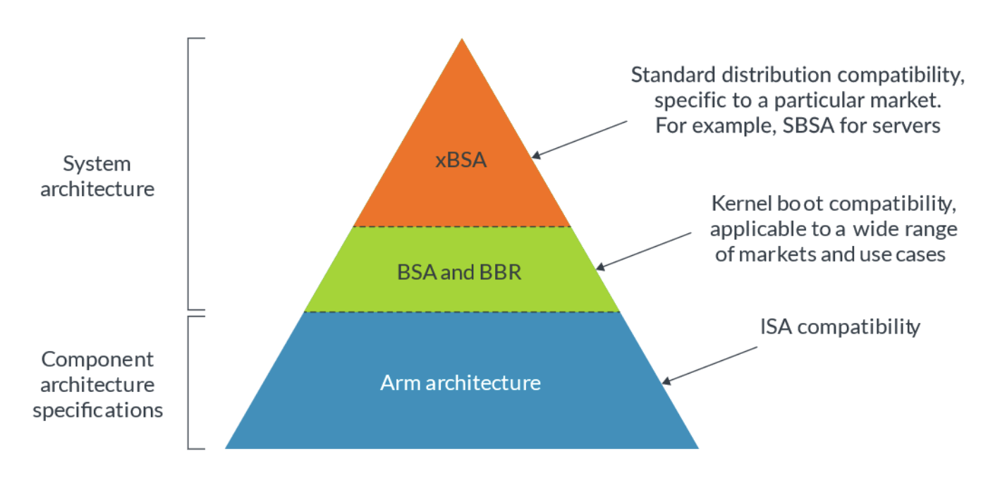

> Learn the architecture - Introducing the Arm architecture (Version 2.1)
> Learn the architecture - Understanding the Armv8.x and Armv9.x extensions (Version 2.1)

## ARM架构

ARM架构分为三种profile，分别是：

- A，Applications：为运行复杂操作系统而设计，例如手机上的CPU。
- R，Real-time：针对实时系统，例如手机上的蜂窝式调制解调器（cellular modem）。
- M，Microcontroller：小型高效能设备，例如手机上的电源管理芯片。

### 什么是架构

架构指的是功能规格（functional specification），ARM架构指的就是处理器的功能规格，也就是处理器的行为模式（how behave）。架构连接了硬件和软件，架构描述了硬件向软件提供了哪些可用的功能。

架构具体说明了：

- 指令集：指令的功能和编码。
- 寄存器集：寄存器的数量、尺寸、功能和初始状态。
- 异常模型：特权等级、异常类型、进入和退出某个异常时会发生什么。
- 内存模型：内存访问如何定序、cache行为以及软件必须如何显式地维护cache。
- Debug、Trace和Profiling：断点如何设置和触发、跟踪工具可以捕获哪些信息以及这些信息的格式。

### 系统架构

处理器仅是系统中的一部分，ARM还提供了描述整个系统需求的规范。这个规范是软件兼容性的基础。

ARM架构是第一层，通过ISA（Instruction Set Architecture）提供了编程模型（programmer's model）。提起ISA，就会想起大一外教Patt到我们学校教的计算机系统概论这门课……ISA这个概念也挺重要的。ISA对硬件进行了抽象，向软件提供了统一的接口。以汽车举例，逆时针转方向盘，车会左转，顺时针转方向盘，车会右转。家用汽车基本都是这种设计，这对司机（软件）是兼容的，司机会控制某辆车的方向，那就肯定也会控制其他车的方向。而这个方向盘具体是通过机械结构改变轮子朝向，还是电子结构控制轮子朝向，这些都是被ISA屏蔽起来的硬件细节。

BSA（Base System Architecture）描述了系统软件可以依赖的硬件系统结构，例如中断控制器、时钟等OS需要的常用设备。BSA适用于各种市场和使用场景，而其他规范例如SBSA（Server BSA）等xBSA可以在BSA的基础上针对特定市场制定。

BBR（Base Boot Requirements）覆盖了基于ARM架构系统的要求，操作系统和虚拟机监视器可以依赖这些要求。BBR建立了固件接口要求，例如UEFI、APCI等。



#### 疑问：BSA和BBR的区别是什么？



### 架构和微架构

微架构说明了特定处理器如何运行，比如流水线长度和布局，cache的数量和尺寸，单个指令需要的时钟周期，哪些可选特性被实现了等问题，都是微架构方面的问题。Cortex-A53和Cortex-A72都是ARMv8-A架构，架构相同，但是微架构大相径庭。

### ARM架构的发展

ARM架构的编号由version、extension和profile构成。ARMv8.5-A的version是8，extension是.5，profile是A。

ARMv8-A是2011年推出的第一个64位ARM架构。ARMv9-A是当前最新的A-profile ARM架构。ARMv9-A基于ARMv8-A开发，并添加了许多新特性。ARMv9.0-A与ARMv8.5-A对齐，继承了它的所有特性并添加了新特性。此后，ARMv8-A和ARMv9-A会各自更新和维护。

特性名称按照`FEAT_<name>`的格式。ARM架构中有一组特性寄存器，保存了处理器支持的特性，包括必须实现的和可选实现的。

实现了.x extension的处理器必须实现.x以及之前所有的extension中的必选特性。例如实现了ARMv8.2-A的处理器必须实现ARMv8.0-A、ARMv8.1-A、ARMv8.2-A的所有必选特性。ARMv8.x-A处理器可以实现下一个扩展中的特性，但是不可以实现这之后扩展中的特性，除非得到ARM公司的特别许可。例如ARMv8.2-A处理器可以实现ARMv8.3-A架构中的特性，但是不能实现ARMv8.4-A以及之后架构中的特性。

SBSA提供了服务器的硬件需求，保证OS和虚拟机监视器能够正确工作。SBSA风味数个等级，每个等级中都规定了处理器应该支持哪些特性。

### 其他ARM架构

ARM架构是最知名的ARM规范，但是ARM还有很多关于SoC（System-on-Chip）中其他组件的规范，例如：

- GIC（Generic Interrupt Controller）
- SMMU（System Memory Management Unit）
- SBSA和TBSA（Trusted Base System Architecture）
- AMBA（Advanced Microcontroller Bus Architecture）
- ……

### ARM文档

- ARM Architecture Reference Manual是架构说明。
- TRM（Technical Reference Manual）描述了某种特定实现的特性。
- CIM（Configuration and Integration Manual）描述了如何将特定处理器集成到系统中。CIM只能通过IP许可证获取。
