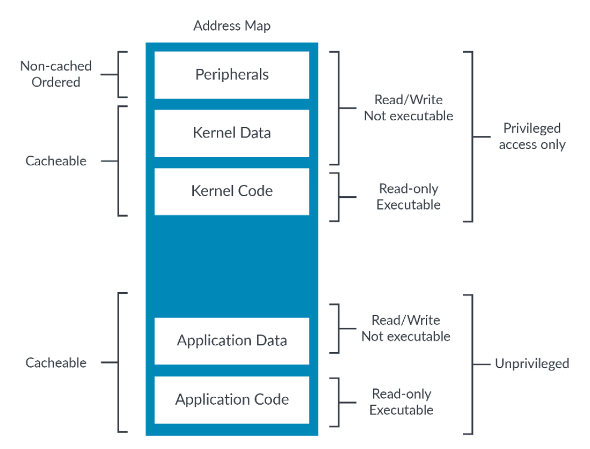
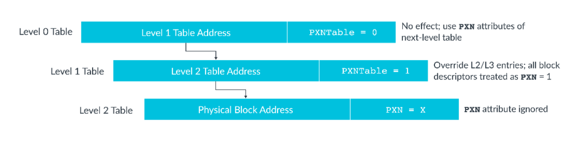

内存模型是一种组织内存和定义内存行为的方法。

地址空间中内存区域的安排称为地址映射。地址映射中一般包含：

> 注意本文中内存的含义，有时指的是内存空间、内存模型（广义），有时指的是真实的物理内存（狭义）。

- 内存/外设
- 在内存中，指令/数据
- 内核空间/用户空间

我们一般需要处理器区别对待内存和外设，通常也需要缓存内存但不缓存外设，外设中一般也不存放指令，此外还需要阻止用户访问内核资源。根据这些要求，内存会被标记为不同的属性，比如是否可读、可写、可执行，是否可缓存，是否需要特权等。

## 描述ARMv8-A中的内存

虚拟地址空间到物理地址空间到映射是由页表定义的。页表中的每一项都是一个页描述符，它为每一个虚拟地址页提供对应的物理地址和该页的属性。以下是比较重要的属性：

- `SH`：shareable，可共享的。
- `AP`：access permission，访问控制。
- `UXN`、`PXN`：execution permission，执行控制。

为了管理更大规模的内存，现在的页表一般是多级的。前级页表中保存的是下一级页表的地址，最后一级页表中保存的才是物理地址。高级页表中的某些属性，例如访问控制、执行控制等，如果被置位则可以覆盖下级页表中的设置。这种特性可以被禁用，这样前级页表中的对应位置就可以挪作他用。

> ARM的MMU分为Stage 1和Stage 2，这种两阶段的地址映射用在虚拟化场景中。Stage 1把VA（Virtual Address，虚拟地址）翻译为IPA（Intermediate Physical Address，中间物理地址），IPA就是虚拟机OS看到的物理地址。Stage 2则是把IPA翻译为PA（Physical Address，物理地址），PA则是真正的物理机上的地址。在不需要虚拟化的情况下，可以只使用Stage 1，此时IPA就是PA。

地址对应的属性来自于页表，而页表是通过MMU（Memory Management Unit）访问的。当MMU Stage 1禁用时，所有数据访问都是`Device_nGnRnE`，所有指令都是可缓存的，所有地址都是可读可写可执行的。当MMU Stage 2禁用时，会不加修改地输出Stage 1的结果。

## 内存访问顺序

ARMv8-A遵守SSE（Simple Sequential Execution）。SSE是一种指令顺序的概念模型。内存访问顺序和指令顺序是两种相关但不同的概念。现代处理器可能会重排指令或并行执行指令以提升性能，SSE表示处理器必须表现得就像按照程序中指定的指令顺序一条一条执行的一样。换句话说，任意重排或者并行都必须是对软件不可见的。

内存访问顺序与内存访问出现在内存系统中的顺序相关。由于write buffer、cache等机制，即使指令是按顺序执行的，相关的内存访问也可能不是按顺序的。所以即使在遵守SSE的处理器上，也必须仔细考虑内存访问顺序的问题。

## 内存类型

所有合法的内存地址都具有一个内存类型。ARMv8-A中有两种内存类型：普通内存和设备内存。

普通内存类型用于普通内存，例如RAM、Flash、ROM等。指令只应该放在普通内存。普通内存被访问时没有任何直接的副作用。举例来说，访问一个外设的FIFO可能导致队列的移动，下次再访问同样的位置获得的就不是上次的数据了，这就属于一种副作用。

对于普通内存，处理器可能会：

- 合并。多次访问同一个位置或者访问连续的几个位置时，处理器可能会把这些访问合并为一个。例如，软件多次写入某个位置，处理器可能只执行了最后一次写操作。
- 投机。处理器可以在软件没有要求的情况下，投机地读取普通内存。例如，处理器可能会识别出软件的内存访问具有某种模式，并预测出接下来可能会被访问的数据，然后进行预取。
- 重排。内存系统中的访问顺序可能会与软件中声明的不同。
  - 对同一个位置的读和写不能被重排。
  - 两次读写访问之间有依赖的不能被重排，比如第二条指令的内存地址是第一条指令读取出来的数据。
- ……

设备内存类型用于外设，外设寄存器通常通过MMIO（Memory-Mapped I/O）的方式访问。设备内存被访问时可以有副作用。设备内存是不可缓存的。设备内存区域不会进行投机数据访问。指令不应该放在设备类型区域。所有设备内存都建议设置为不可执行。这是因为设置为设备类型只会禁止数据投机访问，而设置为不可执行才能禁止指令投机访问。因此为了禁用所有类型的投机访问，必须同时设置为设备类型和不可执行。

设备类型分为四种子类型：

- `Device_GRE`
- `Device_nGRE`
- `Device_nGnRE`
- `Device_nGnRnE`

其中`G`、`R`、`E`分别代表一种属性，`nX`则表示禁用这种属性：

- `G`，Gathering：访问是否可以被合并。
- `R`，Re-ordering：同对一个外设的访问是否可以被重排。
- `E`，Early Write Acknowledge：当一个写入可以被其他观察者看到时，就算该写入已经完成。

内存类型并不直接保存在页描述符中，而是页描述符的一个字段选择的MAIR_ELx（Memory Attribute Indirection Register）中的一项。

## 访问控制

| AP | 非特权（EL0） | 特权（EL1/2/3） |
| :-: | :- | :- |
| `0b00` | N | R/W |
| `0b01` | R/W | R/W |
| `0b10` | N | R |
| `0b11` | R | R |

`AP`属性控制内存地址是否可以被读写，如上表所示。

在标准的访问模型中，有特权的实体可以访问低特权实体的任何资源。比如OS可以访问应用的所有资源，虚拟机监视器可以访问虚拟机的所有资源。但是恶意软件因此可以利用漏洞欺骗OS来访问其他软件的资源，所以OS需要检查系统调用中的指针。

ARM提供了`PSTATE.PAN`（Privileged Access Never）位，置位后可以禁止EL1（或者`E2H==1`时的EL2）访问低特权数据。但是有时OS确实需要访问应用的资源，例如向应用的buffer中写入数据。在`PAN`模式下，EL1和EL2可以使用`LDTR`和`STTR`指令来显式地访问无特权的资源，不会受到`PAN`置位的影响。

除了访问控制，还有执行控制。

- `UXN`：User（EL0） Execute Never，`HCR_EL2.E2H==0`时的EL2，EL3下无效。
- `PXN`：Privileged Execute Never，`HCR_EL2.E2H==0`时的EL2，EL3下称为`XN`。

`SCTLR_ELx`（System Control Register）可以让所有可写的地址都不可执行。另外，所有EL0可写的位置在EL1下都不可执行。建议把所有设备区域设置为`XN`（Execute Never）。

## Access Flag

可以使用AF（Access Flag）来跟踪页表项对应的内存区域是否被访问过。OS可以利用AF来辅助决定换出哪些页。

ARMv8.1-A引入了脏状态，记录了页表项对应的内存区域是否被写入过。当启用脏状态特性时，创建的新页表项会被设置为只读，且DBM（Dirty Bit Modifier）置位。DBM会改变访问控制位（`AP[2]`和`S2AP[1]`）的功能，使其变为记录脏状态。当向新创建的页表项对应的内存区域写入时，硬件会自动将其访问权限设置为读写。综上，DBM置位时，只读的页表项是没有被写入过的，读写的页表项是被写入过的。

## 对齐和大小端

设备类型内存不允许未对齐的访问，普通类型内存可以允许未对齐的访问。可以使用`SCTLR_ELx.A`来设置是否允许未对齐的访问。

在ARMv8-A中，所有指令获取都是按小端格式。对于数据访问，支持大端还是小端是实现定义的。对于同时支持大端和小端的实现中，每个异常等级都可以有不同的大小端设置。

## 内存同名和不匹配的内存类型

同一个物理内存地址可能会对应多个虚拟内存地址，这称为同名（aliasing）。内存的属性是基于虚拟内存地址的，因此要注意多个虚拟内存地址对应的属性是否兼容。

- 内存类型相同，对于设备内存类型，子类型也需要相同。
- 对于普通内存类型，可缓存性和可共享性需要相同。

如果属性不兼容，内存访问的行为表现可能与预期不同，并且影响性能表现。

## 组合Stage 1和Stage 2的内存属性

Stage 1是由OS控制的，Stage 2是由虚拟机监视器控制的。组合两个Stage中内存属性的默认方法是使用最受限的属性，例如Stage 1中是普通内存类型，Stage 2中是设备内存类型，那么最后将使用设备内存类型。也可以通过一些设置（例如`HCR_EL2.FWB`）让Stage 2中的一些属性覆盖Stage 1中的属性。
