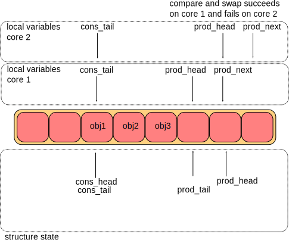
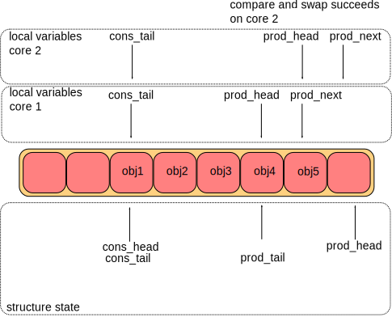

> 本文基于DPDK 22.11.2。
>
> 本文基于ARM架构。

## Environment Abstraction Layer

EAL（Environment Abstraction Layer）负责访问低级资源，比如硬件和内存空间。它为应用和库提供了一个通用接口，隐藏了环境特定的细节。

### Linux用户空间下的EAL

在Linux用户空间环境中，DPDK应用利用`pthread`库，以用户空间应用的身份运行。EAL利用`mmap()`在`hugetlbfs`中进行物理内存分配，然后将内存暴露给DPDK服务层，比如`mempool`库。

#### 初始化和核心启动

部分初始化是由`glibc`的`start`函数完成的，然后就进入了DPDK应用的`main()`函数。核心的初始化和启动是通过`rte_eal_init()`函数完成的，`rte_eal_init()`中使用`pthread_self()`、`pthread_create()`、`pthread_setaffinity_np()`创建执行单元，并分配它到特定的逻辑核。


内存空间、ring、内存池、LPM表和哈希表等对象的初始化也是在main逻辑核，是整个应用初始化的一部分。这些对象的创建和初始化函数不是线程安全的，但完成初始化之后，这些对象本身是线程安全的。

``` plaintext
rte_eal_init():
  lib/eal/include/rte_eal.h
  lib/eal/linux/eal.c
```

#### 内存映射发现和内存预留

EAL使用大页完成大块连续物理内存的分配，并且EAL提供了在这块连续内存中预留命名内存空间的API。

> DPDK作为用户空间应用框架，使用DPDK的软件需要处理的是虚拟地址。但是，硬件不能理解用户空间虚拟地址，而是使用IO地址。IO地址可能是物理地址（Physical Addresses，PA），也可能是IO虚拟地址（IO Virtual Addresses，IOVA）。
>
> DPDK不区分PA和IOVA，而是统一称作IOVA。但是，DPDK会区分PA直接作为IOVA（IOVA as PA），还是IOVA匹配用户空间虚拟地址（IOVA as VA）这两种情况。
>
> 
>
> IOVA as PA模式下，分配给DPDK的所有内存区域的IOVA都是实际的PA，并且虚拟内存的布局与物理内存的布局相同。IOVA as PA的优势在于适用于所有硬件，并且与内核空间之间也很适配（因为物理地址到内核空间虚拟地址的映射是直接映射）。IOVA as PA的缺点之一在于需要root权限，否则无法获取内存区域的真实物理地址。缺点之二是物理内存的布局会影响虚拟内存的布局。如果物理内存碎片化比较严重，那么虚拟内存也会是相同程度的碎片化，从而影响DPDK应用对虚拟内存的使用。
>
> 
>
> IOVA as VA模式下，物理内存会被重新排列，以匹配虚拟内存空间的布局。DPDK通过内核提供的功能完成这一操作，而内核则是通过IOMMU来完成物理内存重映射的。IOVA as VA的优点之一就是无需root权限，之二就是避免物理内存的碎片化影响到虚拟内存。IOVA as VA的缺点在于需要IOMMU的支持。
>
> VFIO（Virtual Function I/O）是内核基础设置，可以把设备寄存器和中断暴露给用户空间应用，并且可以利用IOMMU建立IOVA映射。

DPDK的内存子系统有两种模式，动态模式和传统模式。

动态模式下，DPDK使用的大页数量会随着DPDK应用需求而增减。这种模式下分配的内存不能保证是IOVA连续的。如果需要连续的多页IOVA，建议对所有的物理设备使用VFIO驱动，或使用传统模式。动态模式下也可以使用`-m`或`--socket-mem`指定预分配内存的大小，预分配的内存在运行时不会被释放。动态模式下可以使用`--single-file-segments`命令行参数把多个内存页放在同一个文件中，以满足例如用户空间vhost等应用对于页文件描述符数量的限制。可以使用`--socket-limit`命令行参数来限制DPDK应用可以使用的内存的最大数量。

传统模式下，EAL会在启动时预留全部内存，然后将其重排为IOVA连续的一大块，并且不会在运行时申请或释放大页。需要使用`--legacy-mem`EAL命令行参数启用传统模式，如果不用`-m`或`--socket-mem`指定大小，那么DPDK将使用所有可用的内存大页。

Linux下可以使用`hugetlbfs`中的文件或者匿名映射来获取大页。使用多进程时必须使用`hugetlbfs`，因为多个进程需要映射到同一个大页。EAL会在`--huge-dir`指定的目录中创建`--file-prefix`指定前缀的文件。匿名映射模式虽然不支持多进程，但是优点在于不需要root权限。

### 多线程

DPDK通常会在每个核心上绑定一个`pthread`来避免任务切换导致的性能损失，这可以提供显著的性能提升，但缺少灵活性，而且也不总是高效的。

`lcore`代表EAL线程，在Linux实现中就是`pthread`。`lcore`由EAL创建和管理，并负责完成`rte_eal_remote_launch`发出的工作指令。可以使用`--lcores`命令行参数来设置`lcore`的核心亲和性，从而间接完成绑核操作。

`rte_ring`支持多生产者多消费者队列，但是是非抢占式的，即同一个`ring`同时只能有一个线程进行入队或者出队的操作。如果某个线程A正在进行入队操作，另一个线程B也想要对同一个队列进行入队操作，则B只能等待；如果此时线程A被更高优先级的线程抢占，那么有可能会发生死锁。

> [Linux CPU调度概览](https://man7.org/linux/man-pages/man7/sched.7.html)

POSIX API定义了一种概念：异步信号安全函数（async-signal-safe function），指的是可以安全地在信号处理函数中使用的函数。许多DPDK函数不是可重入的（non-reentrant），因此不是异步信号安全函数。

> [异步信号安全函数](https://man7.org/linux/man-pages/man7/signal-safety.7.html)
>
> [可重入](https://en.wikipedia.org/wiki/Reentrancy_(computing))
>
> 举例来说，函数A执行过程中，被更高优先级的任务B（例如中断、信号处理）抢占，而在任务B中又调用了函数A。如果A在这种情况下也能保证正确性，那么A就是可重入的。

### `malloc`

EAL提供了`malloc` API用于分配任意大小的内存。通常来说，`malloc` API不应该在数据面中使用，因为它比基于池（pool-based）的API慢，因为分配和释放过程中使用了锁。

`malloc`库中有两个主要数据结构：

- `malloc_heap`，用于跟踪每个`socket`的空闲空间，是一个双向链表。
- `malloc_elem`，分配和空闲空间跟踪的基本元素，是链表中的节点。

`malloc_heap`中有以下关键字段：

- `lock`：用于控制同步访问。由于`malloc_heap`中存放着跟踪空闲空间的链表，因此需要防止多个线程同时对链表进行操作。
- `free_head`：指向第一个空闲空间链表节点。
- `first`：指向`malloc_heap`中第一个`malloc_elem`。
- `last`：指向`malloc_heap`中最后一个`malloc_elem`。


由于在动态模式下大页是在运行时向系统申请和释放的，所以相邻的`malloc_elem`对应的实际内存不一定相邻。并且，横跨多页的`malloc_elem`中的页也可能不是IOVA连续的，每个`malloc_elem`只能保证其中的内存是VA连续的。

`malloc_elem`有两种用途，其一是作为空闲或已分配内存的header，其二是作为header padding。

`malloc_elem`中有以下关键字段：

- `heap`：指向持有该`malloc_elem`的`malloc_heap`的指针。
- `prev`、`next`：指向前一个和后一个元素。当前元素被释放时，可以查看是否可以和前后元素进行合并。
- `free_list`：指向前一个和后一个空闲节点。
- `state`：可选值有`FREE`、`BUSY`、`PAD`，表示空闲、已使用或者作为padding。
- `dirty`：仅在`state == FREE`时有效，表示内存中的内容不是全部置零的。`dirty`被置位的情况只会发生在使用`--huge-unlink=never`命令行参数的时候。
- `pad`：保存了padding的长度。
- `size`：包含header在内的数据块总长度。

> 当`hugetlbfs`中的文件或文件的一部分首次在全系统范围映射时，内核会清空其中的数据，以防止数据泄露。EAL会在启动时删除现有后备文件（backing file）并重新创建，然后再进行映射，以保证数据被清空。
>
> 清空内存占了大页映射总耗时的95%以上，因此可以使用`--huge-unlink=never`让EAL直接使用现有的后备文件以及其中的数据，从而跳过清空内存的过程。通常`--huge-unlink=never`用于加快应用重启的速度。

当`malloc_heap`中没有足够的空间满足分配请求时，EAL会像系统申请更多内存。任何申请新页的请求都必须经过主进程。如果主进程不活跃，那么无法申请任何新内存。主进程负责决定什么应该被映射、什么不应该被映射。每个次进程都有自己的本地内存映射，但它们不能修改这些映射，只能从主进程拷贝内存映射到本地内存映射。

## RCU Library

RCU（Ready-Copy Update）是一种无锁同步机制。这个名字的由来指的是写者想要更新数据数据结构中的元素时，需要复制一个元素的副本，然后在副本上修改，最后通过原子操作一次性把副本更新到数据结构中。由于无锁，读者和写者可以同时访问该数据结构，所以当写者从数据结构中删除一个元素时，写者无法确定是否有读者仍持有该元素的引用，所以不能直接释放该元素对应的内存。因此，删除元素的操作需要分为两步：

1. 删除。写者从数据结构中删除该元素的引用（这一操作是原子的），但是暂不释放该元素对应的内存。这一步可以防止该元素被新读者访问。
2. 释放。当写者确认已无读者持有该元素的饮用后，就可以释放该元素对应的内存了，此时该元素被彻底删除。


接下来需要介绍两个概念，静止态和宽限期。线程执行过程中没有持有共享内存的引用的状态称为静止态（quiescent state）。同一个线程在同一个时刻，可能对于共享内存A来说是静止态，但对于共享内存B来说不是静止态。宽限期（grace period）则是写者从数据结构中删除元素到所有读者不再持有对该元素的引用的这一段时间。

问题在于，写者如何确定读者是否处于静止态，并且写者要以最低的成本确定读者是否处于静止态。写者需要轮询读者的状态来确定宽限期是否结束，这会导致内存访问，浪费CPU周期。并且在这期间，写者还不能释放元素对应的内存，导致持续的内存占用。

临界区的长度和读者的数量与宽限期的长度成正比。令临界区更小可以让宽限期更短，然而更小的宽限期需要额外的CPU周期。所以，我们需要短宽限期、大临界区。

对DPDK应用来说，在`while(1)`循环对开始和结束，不持有共享内存的引用，是完美的静止态。把所有共享数据结构访问放入一个单一的大临界区能够将读者侧的同步开销降低到最小。DPDK提供了一个QS变量，可以用于跟踪宽限期的结束，以便缩短宽限期的长度。

## Ring Library

`ring`是一种队列，它有以下特点：

- FIFO。
- 尺寸固定。
- 可以保存指针或者其他大小（必须是4字节的倍数）的数据。
- 无锁实现。
- 支持多消费者、多生产者。
- 支持bulk入队出队：一次入队出队多个元素，数量不足时失败。
- 支持burst入队出队：一次入队出队多个元素，数量不足时尽可能多入队出队。

`ring`结构由两对头尾指针组成，一对给生产者使用，一对给消费者使用。

### 生产者入队

生产者入队需要四步。


第一步需要把`ring->prod_head`和`ring->cons_tail`拷贝到本地变量`prod_head`和`cons_tail`，用于计算`ring`中剩余容量。然后创建本地变量`prod_next`，并指向下一个（或者多个）位置。这一步中还会检查是否有足够的位置来满足该入队操作。



第二步是`ring->prod_head = prod_next`，相当于占座儿的操作，从`ring->prod_tail`到`ring->prod_head`之间的位置可以认为已经被占用，只是对应的数据还没被拷贝进来。这是利用原子操作完成的，“compare and set”，当`ring->prod_head == prod_head`时设置`ring->prod_head = prod_next`。以上图为例，core 1的操作成功了，先占到了位置；core 2只能重新读取`ring->prod_head`、`ring->cons_tail`，重新计算`prod_next`。



第三步是把数据拷贝到`ring`中。core 1和core 2分别向`ring`中拷贝了`obj4`和`obj5`。


第四步是更新`ring->prod_tail = prod_next`。这一步也使用了原子操作，当`ring->prod_tail == prod_head`时设置`ring->prod_tail = prod_next`。以上图为例，core 1成功执行了这个操作，而core 2中原子操作的条件不满足。

然后看看代码。`lib/ring/rte_ring.h`中提供了多种入队的函数，以`rte_ring_enqueue()`为例，它是`rte_ring_enqueue_elem()`的简单包裹，后者是`rte_ring_enqueue_bulk_elem()`的简单包裹。`rte_ring_enqueue_bulk_elem()`根据`ring`的类型不同，调用不同的入队函数。假设`ring->prod.sync_type`是`RTE_RING_SYNC_MT`，即multi-thread safe类型，这也是默认类型，那么将会调用`rte_ring_mp_enqueue_bulk_elem()`，该函数会调用`__rte_ring_do_enqueue_elem()`来完成最终的入队工作。

`__rte_ring_do_enqueue_elem()`参数的签名如下：

``` c
unsigned int
__rte_ring_do_enqueue_elem(
  struct rte_ring *r,       // ring
  const void *obj_table,    // 待入队数据构成的数组
  unsigned int esize,       // 元素的尺寸，必须是4的倍数
  unsigned int n,           // 待入队元素的数量
  enum rte_ring_queue_behavior behavior,
                            // 入队固定数量的元素，否则报错（插入单个元素和bulk模式）
                            // 还是尽可能多地入队数据，不报错（burst模式）
  unsigned int is_sp,       // 是否只有一个生产者
  unsigned int *free_space) // 如果不为NULL，那么会被设置为入队完成后ring的剩余容量
```

解开层层包裹，最终上述函数的参数是`__rte_ring_do_enqueue_elem(r, obj_table, sizeof(void *), 1, RTE_RING_QUEUE_FIXED, RTE_RING_SYNC_MT, NULL)`。

``` c
  uint32_t prod_head, prod_next;
  uint32_t free_entries;

  // 第一步、第二步
  n = __rte_ring_move_prod_head(r, is_sp, n, behavior,
      &prod_head, &prod_next, &free_entries);
  if (n == 0)
    goto end;

  // 第三步
  __rte_ring_enqueue_elems(r, prod_head, obj_table, esize, n);

  // 第四步
  __rte_ring_update_tail(&r->prod, prod_head, prod_next, is_sp, 1);
end:
  if (free_space != NULL)
    *free_space = free_entries - n;
  return n;
```

然后看第一个函数`__rte_ring_move_prod_head()`。



#### 疑问：`__rte_ring_move_prod_head()`

- ARM内存屏障指令的共享域起什么作用？
- `rte_smp_rmb()`内存屏障在保护什么东西？



``` c
static __rte_always_inline unsigned int
__rte_ring_move_prod_head(struct rte_ring *r, unsigned int is_sp,
    unsigned int n, enum rte_ring_queue_behavior behavior,
    uint32_t *old_head, uint32_t *new_head,
    uint32_t *free_entries)
{
  const uint32_t capacity = r->capacity;
  // 记录想要入队多少数据，接下来会计算能够入队多少数据，
  // 并保存在n中，然后会比较max和n，根据不同的入队策略执行不同的动作。
  unsigned int max = n;
  int success;

  // 重试循环，执行成功就退出循环，失败则继续循环
  do {
    /* Reset n to the initial burst count */
    // 重设n和old_head。n是想要入队的数据数量，old_head是当前的ring->prod_head
    n = max;

    *old_head = r->prod.head;

    /* add rmb barrier to avoid load/load reorder in weak
     * memory model. It is noop on x86
     */
    // 在ARM架构中，这实际上是一条dmb ishld指令，能够保证这条指令之前的所有读指令都完成后，
    // 才能执行这条指令之后的内存访问（包括读写）指令。 ish指的是inner shareable domain，
    // 可理解为整个机器范围，也就是所有核心上执行的指令中，这条指令之前的读指令执行完成后，
    // 才能执行这条指令之后的内存访问指令。所以这条指令在防谁呢？
    rte_smp_rmb();

    /*
     *  The subtraction is done between two unsigned 32bits value
     * (the result is always modulo 32 bits even if we have
     * *old_head > cons_tail). So 'free_entries' is always between 0
     * and capacity (which is < size).
     */
    // prod.head，prod.tail，cons.head，cons.tail四个索引的范围并不是[0,r->size)，
    // 而是[0,2^32)，每当需要使用这些索引时，将进行index&(size-1)，来得到合法的索引。
    // 当然，这样以来size必须是2的幂了，但优点在于不必再判断各种边界条件。capacity是ring
    // 中真正可用的entry数量，等于size-1。留一个位置不用的原因应该是为了方便区分空ring和满ring，
    // 否则这两种情况都是prod==cons，不好分辨。所以在创建时设置容量为1024，实际上会得到容量为
    // 1023的ring。当然，可以在创建ring时强制不使用2的幂作为容量，如此以来size会被设置为
    // 大于该容量的最近的2的幂（最坏情况下要浪费一半的空间），capacity会被设置为指定的容量。
    // 另外，这capacity个可用位置并不是固定在ring的某个位置，比如固定前capacity个位置可用，
    // 其他位置留作他用。capacity仅仅是一个数字限制，入队元素时用作检查，数据还是在ring的
    // 整个size内入队出队的。
    //
    // 四个索引逻辑上只会前进（增加）而不会后退（减少），实际上只会在到达2^32范围时重新回到0。
    // 下列式子无论是在正常情况下，还是cons.tail位于接近2^32的位置而prod.head已经回到0附近
    // 的情况下，都能利用32位无符号数的溢出计算出正确的结果。
    *free_entries = (capacity + r->cons.tail - *old_head);

    /* check that we have enough room in ring */
    // unlikely()和likely()可以告诉编译器这个判断更可能为false或true，从而可以对分支预测
    // 进行优化。这里根据入队策略设置了n的值，如果是必须入队固定数量的策略，那么空闲entry不足时
    // 不进行入队，直接返回；如果是尽可能入队的策略，那么根据空闲entry数量调整n的值。
    if (unlikely(n > *free_entries))
      n = (behavior == RTE_RING_QUEUE_FIXED) ?
          0 : *free_entries;

    if (n == 0)
      return 0;

    // 计算新的prod.head位置，如果是单线程模式，直接更新并设置success为真，否则，使用原子操作
    // 来更新，如果失败则重新进行上述循环。
    *new_head = *old_head + n;
    if (is_sp)
      r->prod.head = *new_head, success = 1;
    else
      success = rte_atomic32_cmpset(&r->prod.head,
          *old_head, *new_head);
  } while (unlikely(success == 0));
  return n;
}
```

接下来是第二个函数`__rte_ring_enqueue_elems()`。



#### 疑问：`__rte_ring_enqueue_elems()`

- 为什么单独把元素大小是2x4字节和4x4字节的情况单独拿出来了？
- 复制函数中的循环为什么非要每次循环复制32字节？
- 为什么到4x4字节的情况中忽然换成了`memcpy()`函数来复制？



``` c
static __rte_always_inline void
__rte_ring_enqueue_elems(struct rte_ring *r, uint32_t prod_head,
    const void *obj_table, uint32_t esize, uint32_t num)
{
  /* 8B and 16B copies implemented individually to retain
   * the current performance.
   */
  // 根据元素的大小调用不同的复制函数，果然优化到了极致。8字节和16字节的复制有
  // 专门的函数进行处理，而其他大小的数据都使用4字节对应的函数，内部应该是一个循环。
  if (esize == 8)
    __rte_ring_enqueue_elems_64(r, prod_head, obj_table, num);
  else if (esize == 16)
    __rte_ring_enqueue_elems_128(r, prod_head, obj_table, num);
  else {
    uint32_t idx, scale, nr_idx, nr_num, nr_size;

    /* Normalize to uint32_t */
    // scale：元素大小是多少个4字节
    // nr_num：复制全部元素需要复制多少次4字节
    // idx：ring中目标起始位置
    // nr_idx：逻辑索引值（步长是每个元素）乘以每个元素的大小（单位是4字节），
    //       从而获得真实的索引值（单位是4字节）
    // nr_size：逻辑ring大小（单位是元素数量）乘以每个元素的大小（单位是4字节），从
    //        而获得真实的ring大小（单位是4字节）
    scale = esize / sizeof(uint32_t);
    nr_num = num * scale;
    idx = prod_head & r->mask;
    nr_idx = idx * scale;
    nr_size = r->size * scale;
    __rte_ring_enqueue_elems_32(r, nr_size, nr_idx,
        obj_table, nr_num);
  }
}

static __rte_always_inline void
__rte_ring_enqueue_elems_32(struct rte_ring *r, const uint32_t size,
    uint32_t idx, const void *obj_table, uint32_t n)
{
  // size = nr_size
  // idx = nr_idx
  // n = nr_num
  unsigned int i;
  // &r[1]相当于一个指针，指向((char*)r) + sizeof(*r)的位置，举例来说，假设r指向的结构体
  // 占用的内存是0x20~0x36，那么&r[1]相当于一个指向0x37的、类型与r相同的指针。然后强制转换
  // 成了uint32t的指针，可以推断出内存布局：每个ring在内存中都是以rte_ring结构体作为header，
  // 后面紧挨着ring中实际数据组成的数组。
  uint32_t *ring = (uint32_t *)&r[1];
  const uint32_t *obj = (const uint32_t *)obj_table;
  // 判断一下有没有到达数组的末尾，到达了需要回到数组头部
  if (likely(idx + n <= size)) {
    // 回忆一下，n的意思是要复制多少次4字节，每次循环可以复制8个4字节。这里是在优化什么？
    // 1. 每次循环多复制几次，可以减少循环跳转的次数，降低跳转和预测错误带来的性能损失。
    // 2. cache对齐？但是cache一般不都是64字节一行吗？
    // 3. prefetch？
    // 想不到其他的了……
    for (i = 0; i < (n & ~0x7); i += 8, idx += 8) {
      ring[idx] = obj[i];
      ring[idx + 1] = obj[i + 1];
      ring[idx + 2] = obj[i + 2];
      ring[idx + 3] = obj[i + 3];
      ring[idx + 4] = obj[i + 4];
      ring[idx + 5] = obj[i + 5];
      ring[idx + 6] = obj[i + 6];
      ring[idx + 7] = obj[i + 7];
    }
    // 不够8个4字节的，单独每四个字节复制一下
    switch (n & 0x7) {
    case 7:
      ring[idx++] = obj[i++]; /* fallthrough */
    case 6:
      ring[idx++] = obj[i++]; /* fallthrough */
    case 5:
      ring[idx++] = obj[i++]; /* fallthrough */
    case 4:
      ring[idx++] = obj[i++]; /* fallthrough */
    case 3:
      ring[idx++] = obj[i++]; /* fallthrough */
    case 2:
      ring[idx++] = obj[i++]; /* fallthrough */
    case 1:
      ring[idx++] = obj[i++]; /* fallthrough */
    }
  } else {
    // 如果入队数据分别在数组头尾，那就简单地用个循环复制一下。这里怎么不优化了？
    for (i = 0; idx < size; i++, idx++)
      ring[idx] = obj[i];
    /* Start at the beginning */
    for (idx = 0; i < n; i++, idx++)
      ring[idx] = obj[i];
  }
}

static __rte_always_inline void
__rte_ring_enqueue_elems_64(struct rte_ring *r, uint32_t prod_head,
    const void *obj_table, uint32_t n)
{
    // 略
    // 这里保持了32字节的大小，这个大小有什么特殊性？
    for (i = 0; i < (n & ~0x3); i += 4, idx += 4) {
      ring[idx] = obj[i];
      ring[idx + 1] = obj[i + 1];
      ring[idx + 2] = obj[i + 2];
      ring[idx + 3] = obj[i + 3];
    }
    // 略
}

static __rte_always_inline void
__rte_ring_enqueue_elems_128(struct rte_ring *r, uint32_t prod_head,
    const void *obj_table, uint32_t n)
{
  unsigned int i;
  const uint32_t size = r->size;
  uint32_t idx = prod_head & r->mask;
  rte_int128_t *ring = (rte_int128_t *)&r[1];
  const rte_int128_t *obj = (const rte_int128_t *)obj_table;
  if (likely(idx + n <= size)) {
    // 震惊，这里换成了memcpy，但是还是保持了32字节的大小。
    for (i = 0; i < (n & ~0x1); i += 2, idx += 2)
      memcpy((void *)(ring + idx),
        (const void *)(obj + i), 32);
    switch (n & 0x1) {
    case 1:
      memcpy((void *)(ring + idx),
        (const void *)(obj + i), 16);
    }
  } else {
    for (i = 0; idx < size; i++, idx++)
      memcpy((void *)(ring + idx),
        (const void *)(obj + i), 16);
    /* Start at the beginning */
    for (idx = 0; i < n; i++, idx++)
      memcpy((void *)(ring + idx),
        (const void *)(obj + i), 16);
  }
}
```

最后是第三个函数`__rte_ring_update_tail()`。



#### 疑问：`__rte_ring_update_tail()`

- 显式使用了`ldxr`之后，编译器会自动在后续匹配一个`stxr`吗？
- 如果不是的话，那么对exclusive的内存地址使用`str`也能触发对core的唤醒事件吗？



``` c
static __rte_always_inline void
__rte_ring_update_tail(struct rte_ring_headtail *ht, uint32_t old_val,
    uint32_t new_val, uint32_t single, uint32_t enqueue)
{
  // 如果是要入队的话，那么加一个写屏障，dmb ishst，也就是等待写操作都完成之后，
  // 再更新prod.tail，防止prod.tail先被写入了，导致消费者直接开始消费空位置。
  if (enqueue)
    rte_smp_wmb();
  else
    rte_smp_rmb();
  /*
   * If there are other enqueues/dequeues in progress that preceded us,
   * we need to wait for them to complete
   */
  if (!single)
    // 阻塞，直到r->prod_tail等于prod_head
    rte_wait_until_equal_32(&ht->tail, old_val, __ATOMIC_RELAXED);

  // 这里不需要原子操作，因为满足上面判断条件的生产者只可能有一个。
  ht->tail = new_val;
}

static __rte_always_inline void
rte_wait_until_equal_32(volatile uint32_t *addr, uint32_t expected,
    int memorder)
{
  uint32_t value;

  // 不满足条件时，编译时会报错。这是C++关于原子操作的一些定义。
  RTE_BUILD_BUG_ON(memorder != __ATOMIC_ACQUIRE &&
    memorder != __ATOMIC_RELAXED);

  // 在__ATOMIC_RELAXED模式下，相当于一条ldxr指令。ldxr指令会读取内存数据到寄存器，并且
  // 把该内存地址标记为exclusive。stxr指令可以把数据写入标记为exclusive的内存位置，并将该
  // 内存地址标记为open。如果对一个open的内存地址使用stxr，那么会失败，代表是否成功的结果会
  // 保存在指定的寄存器中。ldxr和stxr指令配合使用，可以实现原子操作。假如线程A想要原子地进行
  // i++操作，那么可以使用ldxr进行读取，此时该内存地址被标记为exclusive。然后线程A计算了i+1
  // 的值。此时，线程B使用stxr指令将i设置为了一个新的值，此时该内存地址变为了open。线程A并
  // 不知道其他线程对i的操作，继续使用stxr指令将i+1保存到i，但发现失败了，因为该地址是open。
  // 因此线程A重新使用ldxr读取i、计算i+1、使用stxr进行保存，如此循环。
  __RTE_ARM_LOAD_EXC_32(addr, value, memorder)
  if (value != expected) {
    // 如果r->prod_tail等于prod_head不相等，说明有另一个生产者正在进行操作，那么短暂地
    // 等待一会儿。__RTE_ARM_SEVL()是一条sevl指令，这条指令让当前core从低功耗状态退出。
    __RTE_ARM_SEVL()
    do {
      // __RTE_ARM_WFE()相当于一条wfe（Wait For Event）指令，这条指令可以让当前core
      // 进入低功耗状态。
      __RTE_ARM_WFE()
      // 重复读取，直到满足条件。当全局监视器标记的对某段内存的exclusive访问被清空时，将向
      // 标记了对该段内存独占访问的核都发送事件。举例来说，当某个核A使用ldxr指令读取某个内存
      // 时，全局监视器中会将该段内存标记为exclusive，然后核A使用wfe进入了低功耗模式，此时
      // 有一个核B使用stxr对该内存进行了写入，将清空全局监视器对这段内存的exclusive标记，
      // 那么核A将收到事件，从而被唤醒。因此，上面的wfe指令不需要对应的sevl指令来唤醒。
      // 问题在于，没有发现显式地使用过stxr，难道说编译器会进行自动转换？还是说str也能唤醒？
      // 不然岂不是每次出队后，都会停在低功耗状态？
      __RTE_ARM_LOAD_EXC_32(addr, value, memorder)
    } while (value != expected);
  }
}
```

### 消费者出队

出队的步骤和入队类似。第一步也是将`ring->cons_head`拷贝到本地的`cons_head`，并创建`cons_next`。第二步是令`ring->cons_head = cons_next`，从`ring->cons_tail`到`ring->cons_head`间的数据就被当前消费者预定了，等待被拷贝出去。第三步是将数据拷贝出来。第四步是令`ring->cons_tail = cons_next`。

直接看代码吧。`lib/ring/rte_ring.h`中提供的出队函数也是多种多样的，单线程、多线程、bulk、burst等。以`rte_ring_dequeue()`为例，它是`rte_ring_enqueue_elem()`的简单包裹，后者是`rte_ring_dequeue_bulk_elem()`的简单包裹。在这个函数中，根据`ring`类型的不同，调用了不同的出队函数。假设`ring->cons.sync_type == RTE_RING_SYNC_MT`，即multi-thread safe类型，那么会调用`rte_ring_mc_dequeue_bulk_elem()`，该函数会调用`__rte_ring_do_dequeue_elem()`来完成出队操作。

`__rte_ring_do_dequeue_elem()`参数的签名如下：

``` c
unsigned int
__rte_ring_do_dequeue_elem(
  struct rte_ring *r,   // ring
  void *obj_table,      // 出队的数据将被放在这里
  unsigned int esize,   // 元素的尺寸，必须是4的倍数
  unsigned int n,       // 待出队元素的数量
  enum rte_ring_queue_behavior behavior,
                        // 出队固定数量的元素，否则报错（插入单个元素和bulk模式）
                        // 还是尽可能多地出队数据，不报错（burst模式）
  unsigned int is_sc,   // 是否只有一个消费者
  unsigned int *available)
                        // 如果不为NULL，那么会被设置为出队完成后ring中剩余元素的数量
```

解开层层包裹，最终上述函数的参数是`__rte_ring_do_dequeue_elem(r, obj_table, sizeof(void *), 1, RTE_RING_QUEUE_FIXED, RTE_RING_SYNC_MT, NULL)`。

``` c
static __rte_always_inline unsigned int
__rte_ring_do_dequeue_elem(struct rte_ring *r, void *obj_table,
    unsigned int esize, unsigned int n,
    enum rte_ring_queue_behavior behavior, unsigned int is_sc,
    unsigned int *available)
{
  uint32_t cons_head, cons_next;
  uint32_t entries;

  // 第一步和第二步
  n = __rte_ring_move_cons_head(r, (int)is_sc, n, behavior,
      &cons_head, &cons_next, &entries);
  if (n == 0)
    goto end;

  // 第三步
  __rte_ring_dequeue_elems(r, cons_head, obj_table, esize, n);

  // 第四步
  __rte_ring_update_tail(&r->cons, cons_head, cons_next, is_sc, 0);

end:
  if (available != NULL)
    *available = entries - n;
  return n;
}
```

先看第一个函数，`__rte_ring_move_cons_head()`与`__rte_ring_move_prod_head()`非常相似。



#### 疑问：`__rte_ring_move_cons_head()`

- 单消费者模式下为什么还额外加了个读屏障？



``` c
static __rte_always_inline unsigned int
__rte_ring_move_cons_head(struct rte_ring *r, unsigned int is_sc,
    unsigned int n, enum rte_ring_queue_behavior behavior,
    uint32_t *old_head, uint32_t *new_head,
    uint32_t *entries)
{
  unsigned int max = n;
  int success;

  /* move cons.head atomically */
  do {
    /* Restore n as it may change every loop */
    n = max;

    *old_head = r->cons.head;

    /* add rmb barrier to avoid load/load reorder in weak
     * memory model. It is noop on x86
     */
    // 注意这里保证的是先读cons.head，后读prod.tail，与入队时正好相反，但是这是在保护什么？
    rte_smp_rmb();

    /* The subtraction is done between two unsigned 32bits value
     * (the result is always modulo 32 bits even if we have
     * cons_head > prod_tail). So 'entries' is always between 0
     * and size(ring)-1.
     */
    *entries = (r->prod.tail - *old_head);

    /* Set the actual entries for dequeue */
    if (n > *entries)
      n = (behavior == RTE_RING_QUEUE_FIXED) ? 0 : *entries;

    if (unlikely(n == 0))
      return 0;

    *new_head = *old_head + n;
    if (is_sc) {
      r->cons.head = *new_head;
      // 只有一个消费者的时候为什么还要加这个屏障？
      rte_smp_rmb();
      success = 1;
    } else {
      success = rte_atomic32_cmpset(&r->cons.head, *old_head,
          *new_head);
    }
  } while (unlikely(success == 0));
  return n;
}
```

然后是第二个函数，`__rte_ring_dequeue_elems()`与`__rte_ring_enqueue_elems()`完全地镜像，这里不水字数了。

第三个函数`__rte_ring_update_tail()`与入队时使用的是同一个函数，只是参数有所不同。区别在于函数开头用的不是写屏障，而是一个`rte_smp_rmb()`读屏障。这应该是防止读取尚未完成时，`ring->cons.tail`就移动了，导致尚未读取出来的数据有被新入队的数据覆盖的风险。

### 同步模式

除了默认的多生产者/多消费者模式，还有单生产者单消费者模式。另外，还有RTS（Relaxed Tail Sync）模式和HTS（Head/Tail Sync）模式。

可以注意到，上文中的代码在修改`tail`会等待`ring->(prod|cons).head`等于本地的`head`，在等待过程中不断spin。RTS模式可以不进行这种等待，而可以直接修改`tail`指针到更新的值。这可以在过载的系统（overcommitted system）中提升出入队的性能。

HTS模式中，出队和入队的操作是完全串行的，同一时刻只能有一个生产者和消费者执行入队和出队操作。在这种模式和单生产者单消费者模式下，`ring`还提供了`peek`的API。

## Mempool Library

> DIMM（Dual In-line Memory Module）是双列直插式内存模块，就是通常所说的“内存条”，双列指的是正反两面的“金手指”是不同的电路，而单列的内存条正反面的金手指是直接相连的相同的冗余电路。直插应该说的是直接怼进去的安装方式吧。SO-DIMM（Small Outline DIMM）是小外形DIMM，就是部分笔记本电脑上用的可以插拔的内存条，比台式机内存条更小一些。DIMM说的是物理外形，与内存条具体是DDR几代等各种参数都无直接关系。
>
> CS（Chip Select）是数字电路设计时常用的一种控制信号，可以从多个集成电路（通常称为chip）中选择一个或一组。一条DIMM上一般都有许多DRAM芯片，而能被同一个CS信号选择出的一组DRAM芯片被称为一个rank。一般来说，一条DIMM有两个rank，正面一个，反面一个，但是这只是惯例，也可以不这样。大多数DIMM上的所有DRAM芯片共享控制信号和数据针脚，但不共享CS信号。因此，同一条DIMM上的多个rank是无法同时被访问的。
>
> 以DDR4为例，每个rank数据位宽是64位。如果每个rank有8个芯片，那么每个芯片的位宽就是8位。如果每个rank只有4个芯片，那么每个芯片的位宽就是16位。芯片中有多个bank，每个bank都是一个二维矩阵，矩阵的每个位置都保存着数据，一般是4位、8位或16位，与芯片的位宽相同。每次访问时，都会选择一个rank，然后到每个芯片中找到同一个bank（同一个指的是索引值）的同一行的同一个cell，读出数据，然后把来自所有芯片的数据拼起来，得到64位数据。内存一般还有burst读取的特性，即读取某个地址时，可以一次性读取从这个地址开始的数个cell中的数据。


如上图所示，是一个2 channel、4 rank的例子。随着内存地址的增长，实际对应的物理位置是按先rank后channel的顺序遍历的，即channel 0的rank 0、channel 1的rank 0、channel 1的rank 0、channel 1的rank 1等等。

当主要任务是L3转发或者流量分类时，只需要读取每个包的前64字节数据。因此如果适当进行padding，使包的起始位置位于不同的channel和rank，就能显著提升（greatly improved）性能表现。


默认`mempool`的底层实现是`ring`。当多个核心访问内存池的空闲区时，由于需要大量原子CAS操作，可能导致性能下降。因此，内存池分配器为每个核心维护了一个cache。每个核心都能完全访问自己cache中的对象（带锁），当cache的空间不足或多余时，cache才会与内存池间交互，从内存池获取内存或将内存放回内存池。

## Mbuf Library

`mbuf`提供了分配和释放缓冲区的能力，一般用作网络包缓存，但也可以用于存放任意数据。`mbuf`的底层实现使用了`mempool`。`rte_mbuf`结构体的header保持尽可能地小，当前的大小是两个cache line，并且最常用的数据放在第一个cache line中。


有两种方法来存储包数据（包括协议头），一是将元数据和包数据放在一起，二是将二者分别放在不同的buffer中。第一种方法的优点是只需一次内存分配和释放操作，第二种方法则更加灵活。DPDK使用了第一种方法，元数据中包含控制信息（消息类型、包文长度、偏移量等）和一个附加的`mbuf`结构体的指针。当数据包需要占用多个buffer时，可通过`mbuf`结构体中的指针将其连接起来。
