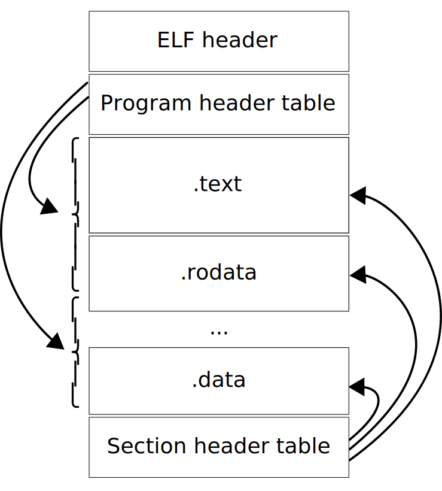

ELF（Executable and Linkable Format）是一种标准文件格式，支持四种类型的文件：

- 可执行文件（executable file），
- 目标代码（object code），
- 共享库（shared library），
- 核心转储（core dump）。



ELF文件有两种视图，通过program header可以访问运行时的segment，通过section header可以访问section。

ELF文件中除了ELF header必定位于起始位置之外，其他结构的顺序是未定义的。

## ELF Header

``` c
// elf.h

#define EI_NIDENT (16)

typedef struct
{
  // 与Elf64_Ehdr完全一致，只是把所有的“64”换成“32”
} Elf32_Ehdr;

typedef struct
{
  unsigned char	e_ident[EI_NIDENT];	/* Magic number and other info */
  Elf64_Half	e_type;			/* Object file type */
  Elf64_Half	e_machine;		/* Architecture */
  Elf64_Word	e_version;		/* Object file version */
  Elf64_Addr	e_entry;		/* Entry point virtual address */
  Elf64_Off	e_phoff;		/* Program header table file offset */
  Elf64_Off	e_shoff;		/* Section header table file offset */
  Elf64_Word	e_flags;		/* Processor-specific flags */
  Elf64_Half	e_ehsize;		/* ELF header size in bytes */
  Elf64_Half	e_phentsize;		/* Program header table entry size */
  Elf64_Half	e_phnum;		/* Program header table entry count */
  Elf64_Half	e_shentsize;		/* Section header table entry size */
  Elf64_Half	e_shnum;		/* Section header table entry count */
  Elf64_Half	e_shstrndx;		/* Section header string table index */
} Elf64_Ehdr;
```

> 源代码缩进如此，可不是我搞乱的。

| Type | Size (in byte) | Usage |
| :- | :- | :- |
| `Elf32_Half`, `Elf64_Half` | `uint16_t` | unsigned 16-bit |
| `Elf32_Word`, `Elf64_Word` | `uint32_t` | unsigned 32-bit |
| `Elf32_Sword`, `Elf64_Sword` | `int32_t` | signed 32-bit |
| `Elf32_Xword`, `Elf64_Xword` | `uint64_t` | unsigned 64-bit |
| `Elf32_Sxword`, `Elf64_Sxword` | `int64_t` | signed 64-bit |
| `Elf32_Addr`, `Elf64_Addr` | `uint32_t`, `uint64_t` | address |
| `Elf32_Off`, `Elf64_Off` | `uint32_t`, `uint64_t` | file offset |
| `Elf32_Section`, `Elf64_Section` | `uint16_t` | section index |
| `Elf32_Versym`, `Elf64_Versym` | `uint16_t` | version symbol information |

上表展示了各个数据结构的位宽和作用。在32位和64位模式下，只有`Addr`和`Off`的位宽不同，因此`Elf32_Ehdr`和`Elf64_Ehdr`分别是52和64字节。

- `e_ident`：16个字节的标识信息，标识了文件类型、位宽、大小端、版本号等。
  - `e_ident[EI_MAG0]`到`e_ident[EI_MAG3]`，值为`"\177ELF"`，表示该文件是一个ELF文件。
  - `e_ident[EI_CLASS]`，文件类型。
    - `ELFCLASSNONE`：非法类型。
    - `ELFCLASS32`，32位。
    - `ELFCLASS64`，64位。
  - `e_ident[EI_DATA]`，数据编码。
    - `ELFDATANONE`，非法编码。
    - `ELFDATA2LSB`，补码，小端
    - `ELFDATA2MSB`，补码，大端
  - `e_ident[EI_VERSION]`，版本号，必须是`EV_CURRENT`。
  - `e_ident[EI_OSABI]`，OS ABI标识符。
    - 比如`ELFOSABI_GNU`、`ELFOSABI_FREEBSD`、`ELFOSABI_OPENBSD`等。
  - `e_ident[EI_ABIVERSION]`，ABI版本。
  - `e_ident[EI_PAD]`，padding。
- `e_type`：文件类型。
  - `ET_REL`: relocatable file.
  - `ET_EXEC`: executable file.
  - `ET_DYN`: shared object file.
  - `ET_CORE`: core file.
  - 其他依赖于OS或处理的类型。
- `e_machine`：架构信息。
  - 比如`EM_X86_64`、`EM_AARCH64`等。
- `e_version`：版本号，必须是`EV_CURRENT`。
- `e_entry`：程序执行的起点，entry point的地址。如果没有entry point，那么置零。
- `e_phoff`：指向program header table的指针。
- `e_shoff`：指向section header table的指针。
- `e_flags`：用于特定处理器的标志。
- `e_ehsize`：ELF header的大小，以字节计。
- `e_phentsize`：program header table中每个表项的大小，以字节计。
- `e_phnum`：program header table中的表项数量。
- `e_shentsize`：section header table中每个表项的大小，以字节计。
- `e_shnum`：section header table中的表项数量。
- `e_shstrndx`：section header table中与section名称相关的表项的索引。

## Section

ELF文件中的每个section都在section header table中有对应的表项；反过来，不是每一个表项都对应一个实际的section。每个section在文件中都是连续的，并且不重叠。

``` c
typedef struct
{
// 略
} Elf32_Shdr;

typedef struct
{
  Elf64_Word	sh_name;		/* Section name (string tbl index) */
  Elf64_Word	sh_type;		/* Section type */
  Elf64_Xword	sh_flags;		/* Section flags */
  Elf64_Addr	sh_addr;		/* Section virtual addr at execution */
  Elf64_Off	sh_offset;		/* Section file offset */
  Elf64_Xword	sh_size;		/* Section size in bytes */
  Elf64_Word	sh_link;		/* Link to another section */
  Elf64_Word	sh_info;		/* Additional section information */
  Elf64_Xword	sh_addralign;		/* Section alignment */
  Elf64_Xword	sh_entsize;		/* Entry size if section holds table */
} Elf64_Shdr;
```

- `sh_name`：section名称，是section header string table section的索引。
- `sh_type`：section类型。
  - `SHT_NULL`：空section。
  - `SHT_PROGBITS`：程序自定义的数据。
  - `SHT_SYMTAB`：符号表。
  - `SHT_STRTAB`：字符串表。
  - `SHT_RELA`：可重定位表，有addend。
  - `SHT_HASH`：符号哈希表。
  - `SHT_DYNAMIC`：动态链接信息。
  - `SHT_NOTE`：信息。
  - `SHT_NOBITS`：没有数据的程序空间。
  - `SHT_REL`：可重定位表，没有addend。
  - `SHT_DYNSYM`：动态链接器符号表。
  - ……
- `sh_flags`：标志位。
  - `SHF_WRITE`：可写的。
  - `SHF_ALLOC`：运行时占用内存。
  - `SHF_EXECINSTR`：可执行的。
  - ……
- `sh_addr`：运行时section的虚拟地址。运行时不出现在内存映像中的section此字段为0。
- `sh_offset`：在ELF文件中的位置，就是从文件头到section起始位置的距离。
- `sh_size`：section的长度，单位是字节。
- `sh_link`：section header table中其他section的索引，具体含义随section类型而不同。
- `sh_info`：其他section信息。
- `sh_addralign`：对齐。必须是0或2的幂，0和1的含义相同。
- `sh_entsize`：如果section中有表，此项表示表项的大小。

### Special Section

| Name | Type | Flags | Description |
| :- | :- | :- | :- |
| `.bss` | `SHT_NOBITS` | `SHF_ALLOC | SHF_WRITE` | 出现在内存中的未初始化数据。 |
| `.comment` | `SHT_PROGBITS` | | 版本控制信息。 |
| `.data`, `.data1` | `SHT_PROGBITS` | `SHF_ALLOC | SHF_WRITE` | 出现在内存中的初始化过的数据。 |
| `.debug` | `SHT_PROGBITS` | | 符号调试信息。 |
| `.dynamic` | `SHT_DYNAMIC` | `SHF_ALLOC | SHF_WRITE?` | 动态链接信息。是否`SHF_WRITE`取决于处理器。 |
| `.dynstr` | `SHT_STRTAB` | `SHF_ALLOC` | 用于动态链接的字符串。 |
| `.dynsym` | `SHT_DYNSYM` | `SHF_ALLOC` | 动态链接符号表。 |
| `.fini` | `SHT_PROGBITS` | `SHF_ALLOC | SHF_EXECINSTR` | 进程终止的可执行指令。 |
| `.got` | `SHT_PROGBITS` | | 全局偏移表。 |
| `.hash` | `SHT_HASH` | `SHF_ALLOC` | 符号哈希表。 |
| `.init` | `SHT_PROGBITS` | `SHF_ALLOC | SHF_EXECINSTR` | 进程初始化的可执行指令。 |
| `.interp` | `SHT_PROGBITS` | | 程序解释器的路径名。 |
| `.line` | `SHT_PROGBITS` | | 符号调试的行号信息。 |
| `.note` | `SHT_PROGBITS` | | 注释信息。 |
| `.plt` | `SHT_PROGBITS` | | Procedure linkage table. |
| `.rel<name>`, `.rela<name>` | | 重定位信息。 |
| `.rodata`, `.rodata1` | `SHT_PROGBITS` | `SHF_ALLOC` | 只读数据。 |
| `.shstrtab` | `SHT_STRTAB` | | 节区名称。 |
| `.strtab` | `SHT_STRTAB` | | 字符串表。 |
| `.symtab` | `SHT_SYMTAB` | | 符号表。 |
| `.text` | `SHT_PROGBITS` | `SHF_ALLOC | SHF_EXECINSTR` | 可执行指令。 |

## Symbol Table

``` c
typedef struct
{
  Elf32_Word	st_name;		/* Symbol name (string tbl index) */
  Elf32_Addr	st_value;		/* Symbol value */
  Elf32_Word	st_size;		/* Symbol size */
  unsigned char	st_info;		/* Symbol type and binding */
  unsigned char	st_other;		/* Symbol visibility */
  Elf32_Section	st_shndx;		/* Section index */
} Elf32_Sym;

typedef struct
{
  Elf64_Word	st_name;		/* Symbol name (string tbl index) */
  unsigned char	st_info;		/* Symbol type and binding */
  unsigned char st_other;		/* Symbol visibility */
  Elf64_Section	st_shndx;		/* Section index */
  Elf64_Addr	st_value;		/* Symbol value */
  Elf64_Xword	st_size;		/* Symbol size */
} Elf64_Sym;

#define ELF32_ST_BIND(val)		(((unsigned char) (val)) >> 4)
#define ELF32_ST_TYPE(val)		((val) & 0xf)
#define ELF32_ST_INFO(bind, type)	(((bind) << 4) + ((type) & 0xf))

/* Both Elf32_Sym and Elf64_Sym use the same one-byte st_info field.  */
#define ELF64_ST_BIND(val)		ELF32_ST_BIND (val)
#define ELF64_ST_TYPE(val)		ELF32_ST_TYPE (val)
#define ELF64_ST_INFO(bind, type)	ELF32_ST_INFO ((bind), (type))
```

- `st_name`：符号名称，是符号字符串表的索引。
- `st_info`：符号类型和绑定信息。
  - `st_bind`：绑定信息，确定链接可见性和行为。
    - `STB_LOCAL`：定义该符号的文件之外不可见。
    - `STB_GLOBAL`：全局可见，对定义该符号的文件之外也可见。
    - `STB_WEAK`：与`STB_GLOBAL`类似，但优先级低。
    - ……
  - `st_type`：符号类型。
    - `stt_object`：数据对象，比如变量、数组。
    - `stt_func`：函数或其他可执行代码。
    - ……
- `st_other`：符号可见性。
- `st_shndx`：section索引。
- `st_value`：符号相关的值，具体含义取决于符号。
  - 在可重定位文件中，`st_value`是从`st_shndx`所指section的虚拟地址起始位置到符号位置的偏移。
  - 在可执行文件和共享库中，`st_value`是一个虚拟地址。
- `st_size`：符号的尺寸。
